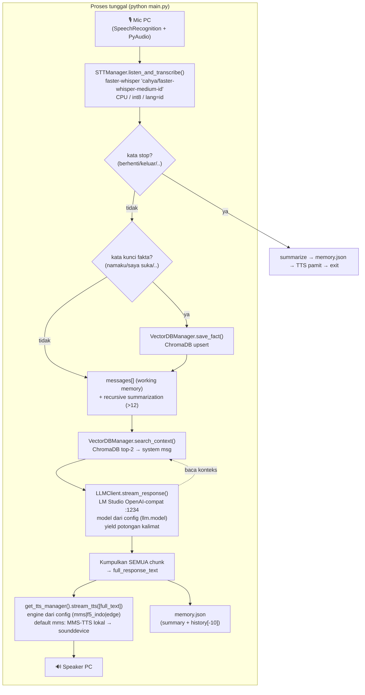

# ARCHITECTURE — AI Assistant Lokal (STT → LLM → TTS)

> Dokumen ini awalnya hasil **Fase Discovery**. **Diperbarui di Fase 2** (branch
> `feature/orchestrator-local-first`) untuk mencerminkan TTS lokal swappable. Bagian yang
> berubah ditandai inline.

## 1. Ringkasan

Aplikasi adalah **voice assistant lokal berbasis CLI** dengan satu loop percakapan sinkron:

```
mic PC → STT (faster-whisper) → memori + RAG → LLM (LM Studio) → TTS (Edge TTS) → speaker PC
```

Entry point tunggal: [`main.py`](../main.py), fungsi `main()`. Dijalankan dengan `python main.py`.
Tidak ada server, tidak ada API, tidak ada antarmuka jaringan. Semua dikendalikan dari satu
proses dan satu thread (kecuali `asyncio.run` internal milik TTS).

## 2. Diagram alur data



## 3. Tahapan loop (detail di `main.py`)

| # | Tahap | Lokasi | Catatan |
|---|-------|--------|---------|
| A | Dengar + transkrip | `main.py:105` → `stt_engine.py` | Blocking. Endpoint = keheningan (silence), bukan VAD streaming. `adjust_for_ambient_noise(0.5s)` tiap loop. |
| — | Cek stop-word | `main.py:113` | Substring match kasar. |
| — | Simpan fakta | `main.py:131-132` | Heuristik keyword (`namaku`, `saya suka`, ...). |
| — | Append working memory | `main.py:135` | `messages[]` in-memory. |
| — | Recursive summarization | `main.py:138-160` | Jika `len(messages) > 12`, kompres bagian tengah jadi 2 kalimat via LLM. |
| B | RAG retrieval | `main.py:163-169` | `search_context()` top-2, disuntik sebagai `system` message sementara. |
| — | LLM streaming | `main.py:177-184` | `stream_response()` yield per-kalimat, **tapi semua dikumpulkan dulu**. |
| C | TTS | `main.py:194` → `tts_factory.py` | `full_response_text` dikirim sebagai **satu chunk** ke engine TTS terpilih (jadi TIDAK ada streaming per-kalimat ke suara saat ini). Engine default `mms` (lokal); bisa `f5_indo`/`edge` via config. |
| — | Persist | `main.py:197` | `save_memory()` → `memory.json`. |

## 4. Komponen & tanggung jawab

- **Orchestrator** — `main.py` (`main()` loop). Mengikat semua modul. Tidak ada kelas; logika di prosedural loop.
- **STT** — `modules/stt_engine.py` `STTManager`. Capture mic + transkrip digabung dalam satu metode.
- **LLM** — `modules/llm_client.py` `LLMClient`. HTTP streaming ke LM Studio (OpenAI-compatible). Memecah token jadi potongan kalimat berdasarkan tanda baca.
- **TTS** — dipilih lewat `modules/tts_factory.py` (`get_tts_manager()`) berdasarkan `config.yaml → tts.engine`. Semua engine berbagi interface `stream_tts`/`speak_chunk`:
  - `mms` *(default)* — `modules/tts_mms.py` `MMSTTSManager`. MMS-TTS (VITS) Bahasa Indonesia, **lokal/offline**, Intel Arc (xpu) bila IPEX ada else CPU → sounddevice.
  - `f5_indo` — `modules/tts_f5.py` `F5TTSManager`. F5-TTS finetune Indonesia, **voice cloning** dari sampel di `voices/`.
  - `edge` *(legacy)* — `modules/tts_engine.py` `EdgeTTSManager`. Edge TTS (online) → mp3 sementara → pygame.
- **Memori jangka panjang (RAG)** — `modules/memory_engine.py` `VectorDBManager`. ChromaDB persisten + embedding `all-MiniLM-L6-v2`. Koleksi `user_profile`.
- **Memori kerja** — `messages[]` di `main.py` + `memory.json` (summary + 10 turn terakhir).

### Modul yang ADA tapi TIDAK terpakai (dead code saat ini)
- `modules/router.py` `Router.identify_intent()` — routing intent (chat/vision/reset). Tidak dipanggil di `main.py`.
- `modules/vision_engine.py` `VisionManager` — Moondream2 + webcam. Tidak dipanggil di `main.py`.
- `modules/memory_rag.py` `MemoryManager` — sistem memori alternatif (koleksi `personal_memory`). Duplikat/menggantikan tidak terpakai.
- `test_stt.py` — namanya STT, isinya **demo TTS**.

## 5. Konfigurasi & lingkungan

- `config.yaml` — sumber konfigurasi (LLM url+model, STT model/device/compute, vision, TTS engine+voice, memory path).
- `data/vectordb/` — penyimpanan ChromaDB (gitignored via `data/`).
- `memory.json` — memori percakapan persisten (root, **kini gitignored** sejak Fase 2).
- `voices/` — sampel suara untuk voice cloning F5 (audio gitignored; lihat `voices/README.md`).
- Dependensi: lihat `requirements.txt` (**diperbarui Fase 2 Langkah 0**).
- Layanan eksternal: **LM Studio** harus jalan di `localhost:1234`. Engine `edge` butuh internet; engine `mms`/`f5_indo` 100% offline.

## 6. Hardware mapping (sesuai komentar config & README)
- STT → CPU (AMD Ryzen 8500G), int8.
- LLM → GPU Intel Arc B580 via LM Studio.
- Vision (jika diaktifkan) → CPU/iGPU.
- TTS → **lokal** (default `mms`): Intel Arc (xpu) bila IPEX ada, else CPU. Engine `edge` = cloud Microsoft.
